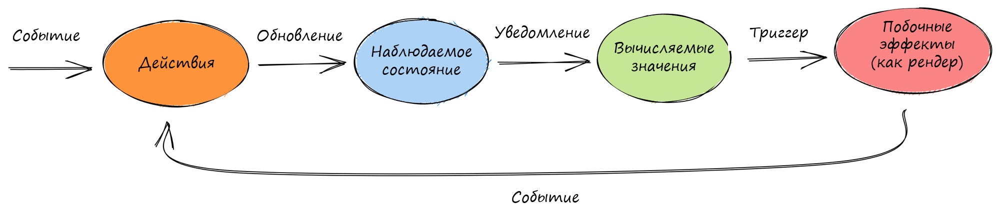

# README


Оригинал этой страницы доступен [здесь](https://mobx.js.org/README.html)


### Введение

> _Всё, что можно получить из состояния приложения, должно быть получено. Автоматически._

MobX - это проверенная в боях библиотека, делающая управление состоянием приложения простым и масштабируемым за счет прозрачного применения функционального реактивного программирования (TFRP). Философия, лежащая в основе MobX, проста:

**Простота**

Пишите **** минималистичный, свободный от шаблонов код, отражающий ваши цели. Пытаетесь обновить поле записи? Используйте старое доброе присвоение JavaScript. Нужно обновление данных в асинхронном процессе? Никаких специальных инструментов не требуется, система реактивности обнаружит все ваши изменения и распространит их туда, где они используются.

**Оптимальный рендеринг без усилий**

Все изменения данных и случаи их использования отслеживаются во время выполнения. Создаётся дерево зависимостей, которое фиксирует все отношения между состоянием и выводом. Это гарантирует, что вычисления, зависящие от вашего состояния, (например, компоненты React, выводящие данные из состояния) выполняются только тогда, когда это строго необходимо. Нет необходимости вручную оптимизировать компоненты с помощью неоптимальных и подверженных ошибкам методов, таких как мемоизация и селекторы.

**Архитектурная свобода**

MobX не навязывает какую-либо архитектуру и позволяет вам управлять состоянием вашего приложения не опираясь на какую-либо структуру UI фреймворка. Это делает ваш код переносимым и, прежде всего, легко тестируемым.

### Быстрый пример

Так как же выглядит код, использующий MobX?

```
import React from "react"
import ReactDOM from "react-dom"
import { makeAutoObservable } from "mobx"
import { observer } from "mobx-react"

// Моделируем состояние приложения
class Timer {
    secondsPassed = 0

    constructor() {
        makeAutoObservable(this)
    }

    increase() {
        this.secondsPassed += 1
    }

    reset() {
        this.secondsPassed = 0
    }
}

const myTimer = new Timer()

// Создаём "user interface", который использует наблюдаемое состояние
const TimerView = observer(({ timer }) => (
    <button onClick={() => timer.reset()}>Прошло секунд: {timer.secondsPassed}</button>
))

ReactDOM.render(<TimerView timer={myTimer} />, document.body)

// Обновляем текст 'Прошло секунд: X' каждую секунду.
setInterval(() => {
    myTimer.increase()
}, 1000)
```

Оболочка _`observer`_ вокруг React компонента _`TimerView`_ автоматически определит, что рендеринг зависит от наблюдаемого timer.secondsPassed, даже если эта связь не определена явно. Система реактивности сама позаботится о повторном ререндере компонента, как только _`timer.secondsPassed`_ обновится в будущем.

Каждое событие (_`onClick`_ / _`setInterval`_) вызывает действие (_`myTimer.increase`_ / _`myTimer.reset`_), которое обновляет наблюдаемое состояние (_`myTimer.secondsPassed`_). Изменения наблюдаемого состояния точно распространяются на все вычисляемые значения и побочные эффекты (_`TimerView`_), которые зависят от вносимых изменений.



Эту концептуальную схему можно применить к приведенному выше примеру или к любому другому приложению, использующему MobX.

Чтобы узнать об основных концепциях MobX на более крупном примере, ознакомьтесь с разделом "Суть MobX" или воспользуйтесь 10-минутным интерактивным введением в MobX и React. Философия и преимущества описанной модели, предоставляемой MobX, также подробно описаны в блоге "[UI как запоздалая мысль](https://michel.codes/blogs/ui-as-an-afterthought)" (англ) и в статье "[Как отделить состояние приложения от UI](https://hackernoon.com/how-to-decouple-state-and-ui-a-k-a-you-dont-need-componentwillmount-cc90b787aa37)" ([a.k.a вам не нужен componentWillMount](https://hackernoon.com/how-to-decouple-state-and-ui-a-k-a-you-dont-need-componentwillmount-cc90b787aa37)) (англ).

### Что говорят о Mobx...


Ребят, #mobx - это не паттерн "издатель-подписчик" и даже не паттерн "Наблюдатель" вашего дедушки. Нет, это тщательно организованный, наблюдаемый пространственный портал, подпитываемый космической силой. Он не обнаруживает изменения, на самом деле, это - крутейший стейт-менеджер 80-го уровня, который заставляет вашу ViewModel подчиниться.



После нескольких недель использования #mobx для одиночных проектов, приятно представить его команде.\
Время: 1/2, Веселье: 2Х



Работа с #mobx - это, по сути, непрерывный цикл, когда я постоянно говорю: “Да нееет, это слишком просто, это точно не сработает!”, но каждый раз я оказываюсь неправым.



Я уже создал большие приложения с MobX, и по сравнению с предыдущими приложениями, использующими Redux, приложения с Mobx легче читать и легче поддерживать.



\#mobx - это именно то, что я всегда хотел иметь! Он действительно удивительно простой и быстрый! Потрясающе! Не пропустите это!


## Дополнительные ресурсы и документация

* [Шпаргалка по MobX](https://michelcodes.gumroad.com/l/mobx6) (англ.)
* [Десятиминутное интерактивное введение в MobX и React](../desyatiminutnoe-vvedenie-v-mobx-i-react.md) (рус.)
* [Курс Egghead.io, основанный на MobX 3](https://egghead.io/courses/manage-complex-state-in-react-apps-with-mobx) (англ.)

### MobX книга

[Бесплатный фрагмент книги](https://books.google.nl/books?id=ALFmDwAAQBAJ\&pg=PP1\&lpg=PP1\&dq=michel+weststrate+mobx+quick+start+guide:+supercharge+the+client+state+in+your+react+apps+with+mobx\&source=bl\&ots=D460fxti0F\&sig=ivDGTxsPNwlOjLHrpKF1nweZFl8\&hl=nl\&sa=X\&ved=2ahUKEwiwl8XO--ncAhWPmbQKHWOYBqIQ6AEwAnoECAkQAQ#v=onepage\&q=michel%20weststrate%20mobx%20quick%20start%20guide%3A%20supercharge%20the%20client%20state%20in%20your%20react%20apps%20with%20mobx\&f=false) (англ.)

### Видео

* [Введение в MobX & React 2020](https://www.youtube.com/watch?v=pnhIJA64ByY) от _Leigh Halliday, 17 мин_. (англ.)
* [ReactNext 2016: Реальный мир MobX от Michel Weststrate](https://www.youtube.com/watch?v=Aws40KOx90U), _40 мин,_ [слайды](https://docs.google.com/presentation/d/1DrI6Hc2xIPTLBkfNH8YczOcPXQTOaCIcDESdyVfG\_bE/edit#slide=id.p) (англ.)
* [CityJS 2020: MobX, от изменяемого к неизменяемому и к наблюдаемым данным](https://www.youtube.com/watch?v=ZHxFrbK3VB0\&feature=emb\_logo) от _Michel Weststrate, 30 мин._ (англ.)
* [OpenSourceNorth: MobX & React на практике (ES5)](https://www.youtube.com/watch?v=XGwuM\_u7UeQ) от Matt Ruby, 42 мин. (англ.)
* [HollyJS 2019: MobX: уникальный симбиоз предсказуемости и скорости](https://www.youtube.com/watch?v=NBYbBbjZeX4\&list=PL8sJahqnzh8JJD7xahG5zXkjfM5GOgcPA\&index=21\&t=0s) от Michel Weststrate, 59 мин. (англ.)
* [React Amsterdam 2016: Управление состоянием это легко](https://www.youtube.com/watch?v=ApmSsu3qnf0\&feature=youtu.be) от Michel Weststrate, 20 мин., [слайды](https://speakerdeck.com/mweststrate/state-management-is-easy-introduction-to-mobx). (англ.)
* {🚀} [React Live 2019: Reinventing MobX](https://www.youtube.com/watch?v=P\_WqKZxpX8g) от Max Gallo, _27 мин._ (англ.)

И еще больше материалов по MobX [можно найти здесь.](https://github.com/mobxjs/awesome-mobx#awesome-mobx)

### Благодарности

MobX вдохновлен принципами реактивного программирования. Он вдохновлен фреймворками MVVM, такими как MeteorJS, knockout и Vue.js , но MobX выводит _прозрачное функциональное реактивное программирование (TFRP)_ на новый уровень и обеспечивает автономную реализацию. Он реализует TFRP без сбоев, синхронно, предсказуемо и эффективно.

Огромное спасибо [Mendix](https://github.com/mendix) за помощь в поддержке MobX, а также за возможность продемонстрировать философию MobX на реальных, сложных, критически важных приложениях.
