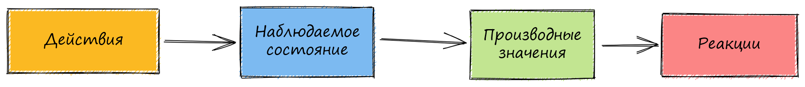

# Суть MobX


Оригинал этой страницы доступен [здесь](https://mobx.js.org/the-gist-of-mobx.html)


### Ключевые понятия

MobX различает следующие три концепции в вашем приложении:

1. Состояние (state)
2. Действия (actions)
3. Производные (derivations)

Давайте подробнее рассмотрим эти концепции ниже (в качестве альтернативы, вы можете пройти [10-ти минутное интерактивное введении в MobX и React](https://mobx.js.org/getting-started), где вы можете интерактивно шаг за шагом углубиться в эти концепции и создать простое ToDo приложение).

### 1. Определяем состояние и делаем его наблюдаемым

_Состояние_ - это данные, управляющие вашим приложением. Обычно существует состояние, зависящее от домена (например список задач ToDo items), и состояние просмотра (например, выбранная в данный момент задача). Состояние похоже на ячейки электронной таблицы, которые содержат значения.

Храните состояние в любой структуре данных, которая вам нравится: простые объекты, массивы, классы, циклические структуры данных или ссылки. Для MobX это не имеет значения. Просто убедитесь, что все свойства, которые вы будете изменять в будущем, помечены как наблюдаемые, чтобы MobX мог их отслеживать.

Вот простой пример:

```
import { makeObservable, observable, action } from "mobx"

class Todo {
    id = Math.random()
    title = ""
    finished = false

    constructor(title) {
        makeObservable(this, {
            title: observable,
            finished: observable,
            toggle: action
        })
        this.title = title
    }

    toggle() {
        this.finished = !this.finished
    }
}
```

**Совет**: этот пример можно сократить, используя _`makeAutoObservable`_, но указывая все явное, мы можем подробнее продемонстрировать различные концепции.

Использование _`observable`_ похоже на превращение свойства объекта в ячейку электронной таблицы. Но в отличие от электронных таблиц, эти значения могут быть не только примитивными значениями, но и ссылками, объектами и массивами.

А что насчет _`toggle`_, который мы отметили как _`action`_?

### 2. Обновляем состояние, используя действия

Действие (экшен, action) - это любой фрагмент кода, который изменяет состояние. Например, пользовательские события, прием данных c backend'a, запланированные события и т.д. Действие похоже на пользователя, который вводит новое значение в ячейку электронной таблицы.

В модели Todo выше, мы видим метод _`toggle`_, изменяющий значение _`finished`_. _`finished`_ отмечен как _`observable`_ (наблюдаемый). Все фрагменты кода, изменяющие `observable` (наблюдаемые свойства) рекомендуется помечать как _`action`_ (действие).

Использование действий помогает структурировать код и предотвращает непреднамеренное изменение состояния (т.е. когда вы не собирались менять состояние). Методы, изменяющие состояние, называются _`actions`_ (т.е. действиями) в терминологии MobX. В отличие от представлений (_views_), которые вычисляют новую информацию на основе текущего состояния, каждый метод должен служить не более чем одной из этих двух целей.

### 3. Создаем производные данные, автоматически реагирующие на изменение состояния

_Все_, что может быть получено из состояния и с чем не придется взаимодействовать дальше, является производными данными. Они бывают разные:

* _Пользовательский интерфейс_
* _Полученные данные_, например количество невыполненных задач в списке дел
* _Backend интеграции_, например, отправка изменений на сервер

MobX различает два вида производных данных:

* _Вычисляемые значения_, которые всегда могут быть извлечены из текущего наблюдаемого состояния, используя чистые функции.
* _Реакции (сайд-эффекты)_, т.е. побочные эффекты, происходящие автоматически при изменении состояния (мост между императивным и реактивным программированием)

Делая первые шаги в MobX, люди склонны злоупотреблять реакциями. Золотое правило гласит: всегда используйте вычисляемые значения (_`computed`_), если вы хотите создать значение на основе текущего состояния.

#### 3.1 Моделируйте производные значения используя вычисляемые

Чтобы создать _`вычисляемое значение`_, определите свойство с помощью геттер функции _`get`_ и отметьте его как _`computed`_ (вычисляемое) с помощью _`makeObservable`_.

```
import { makeObservable, observable, computed } from "mobx"

class TodoList {
    todos = []
    get unfinishedTodoCount() {
        return this.todos.filter(todo => !todo.finished).length
    }
    constructor(todos) {
        makeObservable(this, {
            todos: observable,
            unfinishedTodoCount: computed
        })
        this.todos = todos
    }
}
```

MobX гарантирует, что _`unfinishedTodoCount`_ будет обновляться автоматически, в случае если будет добавлена новая задача в список todo или если будет изменено свойство _`finished`_ в какой-либо задаче.

#### 3.2. Моделируем побочные эффекты, используя реакции

Чтобы вы, как пользователь, могли видеть изменение состояния или вычисленных значений на экране, необходима _реакция_, перерисовывающая часть графического интерфейса, когда это будет необходимо.

Реакции похожи на вычисляемые значения, но вместо производства новых данных реакции создают побочные эффекты, такие как вывод в консоль, выполнение сетевых запросов, постепенное обновления дерева компонентов React для исправления DOM и т.д.

Короче говоря, реакции соединяют миры [реактивного](https://en.wikipedia.org/wiki/Reactive\_programming) и [императивного](https://en.wikipedia.org/wiki/Imperative\_programming) программирования.

Безусловно, наиболее часто используемой формой реакций являются компоненты UI. Обратите внимание, что возможно вызвать побочные эффекты как от действий, так и от реакций. Побочные эффекты, которые имеют четкое, явное происхождение, из-за которого они могут быть вызваны (такие как выполнение сетевого запроса при отправке формы), должны быть вызваны явно из соответствующего обработчика событий.

#### 3.3 Реактивные React компоненты

Если вы используете React, вы можете сделать свои компоненты реактивными, обернув их функцией  _`observer`_  из пакета _mobx-react_ или _mobx-react-lite_, который вы [выбрали во время установки](ustanovka.md). В этом примере мы будем использовать более легкий пакет _`mobx-react-lite`_.

```
import * as React from "react"
import { render } from "react-dom"
import { observer } from "mobx-react-lite"

const TodoListView = observer(({ todoList }) => (
    <div>
        <ul>
            {todoList.todos.map(todo => (
                <TodoView todo={todo} key={todo.id} />
            ))}
        </ul>
        Tasks left: {todoList.unfinishedTodoCount}
    </div>
))

const TodoView = observer(({ todo }) => (
    <li>
        <input type="checkbox" checked={todo.finished} onClick={() => todo.toggle()} />
        {todo.title}
    </li>
))

const store = new TodoList([new Todo("Get Coffee"), new Todo("Write simpler code")])
render(<TodoListView todoList={store} />, document.getElementById("root"))
```

_`observer`_ конвертирует React компоненты в производные данных, которые они отображают.

При использовании MobX нет деления на умные или глупые компоненты. Все компоненты рендерятся как умные, но определяются как глупые. MobX просто заботится о том, чтобы компоненты всегда перерисовывались, когда это необходимо и не более того.

Таким образом, обработчик onClick в примере выше заставит соответствующий компонент TodoView обновиться, так как он использует toggle действие. А компонент TodoListView обновиться только в том случае, если изменится количество незавершенных задач. И если вы удалите строку Tasks Left (или поместите её в отдельный компонент), то TodoListView компонент больше не будет обновляться при переключении статуса задачи выполнено/невыполнено.

Чтобы узнать больше о том, как React работает с MobX, ознакомьтесь с разделом "[_Интеграция с React_](../mobx-i-react/integraciya-s-react.md)".

#### 3.4 Кастомные реакции

Они редко вам понадобятся. Но их можно создать с помощью _`autorun`_, _`reaction`_, _`when`_ функций именно под ваши специфические ситуации и задачи. Например, следующий _`autorun`_ выводит сообщение каждый раз, когда изменяется _`unfinishedTodoCount`_:

```
// Функция, автоматически наблюдающая за состоянием
autorun(() => {
    console.log("Осталось задач: " + todos.unfinishedTodoCount)
})
```

Почему новое сообщение печатается каждый раз, когда изменяется _`unfinishedTodoCount`_? Ответ заключается в следующем правиле:

_MobX_ реагирует на любое существующее наблюдаемое свойство, которое считывается во время выполнения отслеживаемой функции.

Чтобы узнать больше о том, как MobX определяет, на какие наблюдаемые объекты необходимо реагировать, ознакомьтесь с разделом "[_Разбираем реактивность_](../sovety-i-rekomendacii/razbiraem-reaktivnost.md)".

### Принципы

MobX использует однонаправленный поток данных, в котором действия изменяют состояние, что, в свою очередь, обновляет все затронутые представления.&#x20;



1. Все _производные_ обновляются **автоматически** и **атомарно** при изменении состояния. В результате, наблюдать промежуточные значения невозможно.
2. По умолчанию, _все производные_ обновляются **синхронно**. Это означает, что, например, _действия_ могут безопасно проверять вычисленное значение непосредственно после изменения состояния.
3. _Вычисляемые значения_ обновляются **лениво** (в фоне). Любое вычисленное значение, которое активно не используется, не будет обновляться до тех пор, пока оно не потребуется для побочного эффекта (ввода-вывода). Если представление больше не используется, о нем автоматически позаботится сборщик мусора.
4. Все _вычисленные значения_ должны быть **чистыми**. Они не должны менять _состояние_.

Чтобы узнать больше о фоновом контексте, ознакомьтесь с [основополагающими принципами, лежащими в основе MobX](https://hackernoon.com/the-fundamental-principles-behind-mobx-7a725f71f3e8).

### Попробуйте MobX в деле прямо сейчас!

Вы можете самостоятельно поиграть с примерами выше в [CodeSandbox](https://codesandbox.io/s/concepts-principles-il8lt?file=/src/index.js:1161-1252).

Линтинг

Если вам трудно принять концептуальную модель MobX, настройте её так, чтобы она была очень строгой и предупреждала вас во время выполнения всякий раз, когда вы отклоняетесь от этих шаблонов. Ознакомьтесь с разделом linting MobX.

