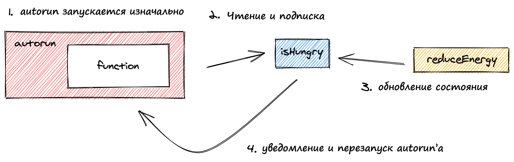

# Реакции (reactions) {🚀}


Оригинал этой страницы доступен [здесь](https://mobx.js.org/reactions.html)


### Запуск побочных эффектов через реакции

Реакции - важная концепция для понимания, поскольку именно здесь объединяется вся магия MobX. Цель реакций - моделировать автоматически происходящие побочные эффекты. Их значение заключается в создании "потребителей" для вашего наблюдаемого состояния и _автоматическом_ запуске побочных эффектов всякий раз, когда что-то изменяется.

Однако важно понимать, что обсуждаемые здесь API, не должны постоянно использоваться. Они часто абстрагируются в других библиотеках (например, mobx-react) или в абстракциях, специфичных для вашего приложения.

Но чтобы разобраться с MobX, давайте посмотрим на создание реакций. Самый простой способ - использовать утилиту _`autorun`_. Кроме этого, еще есть_`reaction`_ и _`when`_.

### Autorun (автозапуск)

Использование:

* `autorun(effect: (reaction) => void)`

autorun-функция принимает другую функцию, которая должна выполняться каждый раз, когда изменяется наблюдаемый ей объект. Эта функция также запускается один раз при создании _`autorun`_. Эта функция реагирует только на изменения наблюдаемого состояния, на то, что вы пометели как _`observable`_ или _`computed`_.

#### Как работает отслеживание

Автозапуск работает, выполняя _`effect`_ в _реактивном контексте_. Во время выполнения предоставленной функции MobX отслеживает все наблюдаемые и вычисляемые значения, которые прямо или косвенно считываются эффектом. Как только функция завершится, MobX соберет и подпишется на все наблюдаемые объекты (к которым было обращение и чьи значения были считаны) и будет ждать, пока какое-либо значение снова не изменится. Как только это происходит, _`autorun`_ сработает снова, повторяя весь процесс.



Это схема того, как работает пример ниже:

#### Пример

```
import { makeAutoObservable, autorun } from "mobx"

class Animal {
    name
    energyLevel

    constructor(name) {
        this.name = name
        this.energyLevel = 100
        makeAutoObservable(this)
    }

    reduceEnergy() {
        this.energyLevel -= 10
    }

    get isHungry() {
        return this.energyLevel < 50
    }
}

const giraffe = new Animal("Gary")

autorun(() => {
    console.log("Уровень энергии:", giraffe.energyLevel)
})

autorun(() => {
    if (giraffe.isHungry) {
        console.log("Теперь я голоден!")
    } else {
        console.log("Я не голоден!")
    }
})

console.log("Теперь изменим состояние!")
for (let i = 0; i < 10; i++) {
    giraffe.reduceEnergy()
}
```

Запустив этот код, вы получите следующий вывод:

```
Уровень энергии: 100
Я не голоден!
Теперь изменим состояние!
Уровень энергии: 90
Уровень энергии: 80
Уровень энергии: 70
Уровень энергии: 60
Уровень энергии: 50
Уровень энергии: 40
Теперь я голоден!
Уровень энергии: 30
Уровень энергии: 20
Уровень энергии: 10
Уровень энергии: 0
```

Как вы можете видеть выше, в первых двух строках вывода обе функции автозапуска запускаются один раз при их инициализации. Это все, что вы бы увидели без цикла _`for`_.

После запуска цикла _`for`_ для изменения _`energyLevel`_ с помощью действия _`reduceEnergy`_, мы увидим новую запись в логе каждый раз, когда функция _`autorun`_ замечает изменение своего наблюдаемого состояния:

1. Для функции «Уровень энергии» изменение состояния - это каждый раз, когда наблюдаемый уровень энергии изменяется (всего 10 раз).
2. Для функции «Теперь я голоден» это происходит каждый раз, когда вычисляется _`isHungry`_ (только один раз).

### Reaction (реакция)

Использование:

* `reaction(() => value, (value, previousValue, reaction) => { sideEffect }, options?)`.

Функция _`reaction`_ аналогична _`autorun`_, но дает более точный контроль над тем, какие наблюдаемые объекты будут отслеживаться. _`reaction`_ принимает две функции. Первая - это функция _данных_, отслеживающая и возвращающая данные, используемые второй функцией в качестве входных данных. Вторая функция - это функция _эффекта_. Важно отметить, что побочный эффект реагирует только на данные, к которым обращались в первой функции (функции данных), которые могут быть меньше, чем данные фактически используемые в функции эффекта.

Типичный шаблон заключается в том, что вы создаете то, что вам нужно в побочном эффекте в _функции данных_ и, таким образом, более точно контролируете момент срабатывания эффекта. По умолчанию, результат _`функции данных`_ должен измениться, чтобы сработала _`функция эффекта`_. В отличие от _`autorun`_, побочный эффект не запускается при инициализации функции, а срабатывает только после того, как выражение данных впервые вернет новое значение.

<details>

<summary>Пример: данные и функция эффекта</summary>

В приведенном ниже примере, реакция запускается только один раз при изменении _`isHungry`_. Изменения в _`giraffe.energyLevel`_, используемые _функцией эффекта_, не приводят к её выполнению. Если вы хотите, чтобы реакция реагировала и на это,  то вам также нужно было бы получить к ней доступ в _функции данных_ и вернуть ее.

```
import { makeAutoObservable, reaction } from "mobx"

class Animal {
    name
    energyLevel

    constructor(name) {
        this.name = name
        this.energyLevel = 100
        makeAutoObservable(this)
    }

    reduceEnergy() {
        this.energyLevel -= 10
    }

    get isHungry() {
        return this.energyLevel < 50
    }
}

const giraffe = new Animal("Gary")

reaction(
    () => giraffe.isHungry,
    isHungry => {
        if (isHungry) {
            console.log("Теперь я голоден!")
        } else {
            console.log("Я не голоден!")
        }
        console.log("Уровень энергии:", giraffe.energyLevel)
    }
)

console.log("Сейчас изменим состояние!")
for (let i = 0; i < 10; i++) {
    giraffe.reduceEnergy()
}
```

Вывод:

```
Сейчас изменим состояние!
Теперь я голоден!
Уровень энергии: 40
```

</details>

### When

Использование:

* `when(predicate: () => boolean, effect?: () => void, options?)`
* `when(predicate: () => boolean, options?): Promise`

Функция _`when`_ наблюдает и запускает переданную функцию _предиката_, пока она не вернет _`true`_. Как только это происходит, переданная _`функция эффекта`_ выполняется, и автозапуск удаляется.

Функция _`when`_ возвращает диспоузер, позволяющий вам отменить его вручную, если вы не передадите вторую функцию эффекта. Если вы передаете функцию эффекта, то в этом случае _`when`_ возвращает промис.

<details>

<summary>Пример: очистка ресурсов реактивным способом</summary>

_`when`_ действительно полезен для удаления или отмены вещей реактивным способом. Например:

```
import { when, makeAutoObservable } from "mobx"

class MyResource {
    constructor() {
        makeAutoObservable(this, { dispose: false })
        when(
            // Как только...
            () => !this.isVisible,
            // ... затем.
            () => this.dispose()
        )
    }

    get isVisible() {
        // Показывает, виден ли элемент.
    }

    dispose() {
        // Очищение некоторых ресурсов.
    }
}
```

Как только _`isVisible`_ становится ложным, вызывается метод _`dispose`_, выполняющий некоторую очистку _`MyResource`_.

</details>

#### await when(...)

Если _функция эффекта_ не указана, _`when`_ возвращает _`Promise`_. Это прекрасно сочетается с _`async/await`_, позволяя вам дожидаться изменений в наблюдаемом состоянии.

```
async function() {
    await when(() => that.isVisible)
    // etc...
}
```

Для преждевременной отмены можно вызвать метод _`.cancel()`_ для возвращаемого самим собой промиса.

### Правила

Есть несколько правил, применимых к любому реактивному контексту:

1. Затронутые реакции запускаются по умолчанию немедленно (синхронно) при изменении наблюдаемых объектов. Однако, они не будут выполняться до окончания текущего самого внешнего (транзакционного) действия.
2. Autorun отслеживает только наблюдаемые объекты, считываемые во время синхронного выполнения переданной функции, но не отслеживает ничего, что происходит асинхронно.
3. Autorun не будет отслеживать наблюдаемые объекты, считываемые действием, вызванным самим автозапуском, поскольку действия всегда не отслеживаемы.

Дополнительные примеры того, на что именно MobX будет реагировать, а на что нет смотрите в разделе «[Разбираем реактивность](../sovety-i-rekomendacii/razbiraem-reaktivnost.md)». Для получения более подробной технической информации о том, как работает отслеживание, прочитайте сообщение в блоге "[Становимся полностью реактивными: подробное объяснение MobX](https://hackernoon.com/becoming-fully-reactive-an-in-depth-explanation-of-mobservable-55995262a254)".

### Всегда избавляйтесь от реакций

Функции переданные в _`autorun`_, _`reaction`_ и _`when`_ собираются сборщиком только в том случае, если сборщиком собраны все наблюдаемые ими объекты. В принципе, они вечно ждут новых изменений в используемых ими наблюдаемых объектах. Чтобы прервать вечное ожидание, все они возвращают функцию удаления, которую можно использовать для остановки и отписки от любых наблюдаемых объектов, которые они использовали ранее.

```
const counter = observable({ count: 0 })

// Устанавливает autorun и печатает 0. 
const disposer = autorun(() => { 
    console.log(counter.count)
})

// Печатает: 1
counter.count++

// Останавливает autorun
disposer()

// НЕ печатает.
counter.count++
```

Мы настоятельно рекомендуем всегда использовать функцию disposer, возвращаемую этими методами, как только их побочный эффект станет больше не нужен. Невыполнение этого требования может привести к утечке памяти.

Аргумент функции _`reaction`_,  передаваемый в качестве второго аргумента функциям эффекта _`reaction`_ и _`autorun`_, также может использоваться для преждевременной очистки реакции путем вызова _`reaction.dispose()`_.

<details>

<summary>Пример: утечка памяти</summary>

```
class Vat {
    value = 1.2

    constructor() {
        makeAutoObservable(this)
    }
}

const vat = new Vat()

class OrderLine {
    price = 10
    amount = 1
    constructor() {
        makeAutoObservable(this)
        
        // Этот autorun будет собран сборщиком мусора вместе с текущим
        // экземпляром orderline, т.к. он использует наблюдаемые объекты
        // только из контекста `this`. Нет строгой необходимости избавляться
        // от него после удаления экземпляра OrderLine.

        this.disposer1 = autorun(() => {
            doSomethingWith(this.price * this.amount)
        })

        // Этот autorun не будет собран сборщиком мусора вместе с текущим
        // экземпляром orderline, поскольку сохраняется ссылка для
        // уведомления об этом автозапуске, который, в свою очередь,
        // сохраняет this в области видимости.
        this.disposer2 = autorun(() => {
            doSomethingWith(this.price * this.amount * vat.value)
        })
    }

    dispose() {
        // Итак, чтобы избежать тонких проблем с памятью, 
        // всегда вызывайте disposer(), когда реакции больше не нужны.
        this.disposer1()
        this.disposer2()
    }
}
```

</details>

### Используйте реакции экономно!

Как уже было сказано, вам не придется часто создавать реакции. Вполне может быть, что ваше приложение не использует ни один из этих API напрямую, и единственный способ создания реакций — косвенный, например, через _`observer`_ из привязок mobx-react.

Перед установкой реакции рекомендуется сначала проверить, соответствует ли она следующим принципам:

1. **Используйте реакции только в том случае, если нет прямой связи между причиной и следствием**. Если побочный эффект должен произойти в ответ на очень ограниченный набор событий/действий, часто будет понятнее напрямую вызвать эффект от этих конкретных действий. Например, если нажатие кнопки отправки формы должно привести к отправке сетевого запроса, будет понятнее активировать этот эффект непосредственно в ответ на событие _`onClick`_, а не косвенно через реакцию. Напротив, если любое изменение, которое вы вносите в состояние формы, должно автоматически попадать в локальное хранилище, то реакция может быть очень полезной, т.к. вам не нужно запускать этот эффект для каждого отдельного события _`onChange`_.
2. **Реакции не должны обновлять другие наблюдаемые объекты.** Будет ли реакция изменять другие наблюдаемые объекты? Если ответ «да», то обычно наблюдаемый объект, который вы хотите обновить, должен быть помечен как _`computed`_. Например, если коллекция задач изменена, не используйте реакцию для вычисления количества оставшихся задач, а пометьте оставшиеся задачи как вычисляемые значения. Это приведет к более ясной и легкой отладке кода. Реакции не должны вычислять новые данные, а только вызывать эффекты.
3. **Реакции должны быть независимыми**. Ваш код полагается на какую-то другую реакцию, которая должна быть запущена первой? Если это так, вы, вероятно, либо нарушили первое правило, либо новая реакция, которую вы собираетесь создать, должна быть объединена с той, от которой она зависит. _MobX не гарантирует порядок, в котором будут выполняться реакции_.

Существуют сценарии из реальной жизни, которые не вписываются в вышеуказанные принципы. Вот поэтому они являются принципами, а не законами. Но исключения редки, поэтому нарушайте их только в самом крайнем случае.

### Опции {🚀}

Поведение _`autorun`_, _`reaction`_ и _`when`_ можно дополнительно настроить, передав аргумент параметров, как показано в примерах выше.

#### name

Эта строка используется в качестве отладочного имени для реакции в [наблюдателях слушателей событий](../sovety-i-rekomendacii/analiziruem-reaktivnost.md) и [инструментах разработчика MobX](https://github.com/mobxjs/mobx-devtools).

#### _`fireImmediately`_ (reaction)

Логическое значение, указывающее, что функция эффекта должна запускаться немедленно после первого запуска функции данных. Установлено _`false`_ по умолчанию.

#### _`delay`_ (autorun, reaction)

Количество миллисекунд, используемых для задержки функции эффекта. Если значение ноль (по умолчанию), управление не осуществляется.

#### _`timeout`_ (when)

_`when`_ будет ождать заданное количество времени. Как только пройдет установленное количество времени _`when`_ отклонит/выбросит исключение.

#### _`onError`_

По умолчанию любое исключение, вызванное внутри реакции, будет зарегистрировано, но не будет вызвано в дальнейшем. Это делается для того, чтобы исключение в одной реакции не помешало запланированному выполнению других, возможно, несвязанных реакций. Это также позволяет реакциям восстанавливаться после исключений. Создание исключения не прерывает отслеживание, выполняемое MobX, поэтому последующие запуски реакции могут завершиться нормально, если причина исключения будет устранена. Эта опция позволяет переопределить это поведение. Можно установить глобальный обработчик ошибок или полностью отключить перехват ошибок с помощью [configure](../tonkaya-nastroika/konfigurirovanie.md).

#### `scheduler` _(autorun, reaction)_

Установите собственный планировщик _для_ определения того, как должен быть запланирован повторный запуск функции автозапуска. _`scheduler`_ принимает функцию, которая должна быть вызвана в какой-то момент в будущем. Например: _`{ scheduler: run => { setTimeout(run, 1000) }}`_

#### _`equals`_: (reaction)

По умолчанию установлено значение _`comparer.default`_. Эта функция сравнения используется для сравнения предыдущего и следующего значений, полученных функцией данных. Функция эффекта вызывается только в том случае, если эта функция возвращает false.

Ознакомьтесь с разделом "[Встроенные компараторы](vychislyaemye-znacheniya-computeds.md#vstroennye-komparatory)".


