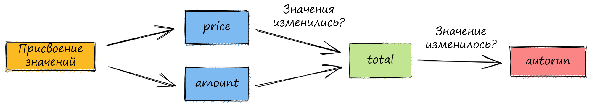

# Вычисляемые значения (computeds)


Оригинал этой страницы доступен [здесь](https://mobx.js.org/computeds.html)


### Получение информации с помощью вычисляемых значений

Использование:

* `computed` _(annotation)_
* `computed(options)` _(annotation)_
* `computed(fn, options?)`

Вычисляемые значения могут использоваться для вывода информации из наблюдаемых объектов. Они "лениво" вычисляются, их вывод кэшируется и перерасчитывается только в том случае, если изменяется одна из наблюдаемых величин. Если их ничто не наблюдает, то они полностью отключаются.

Концептуально они очень похожи на формулы в электронных таблицах, и их нельзя недооценивать. Они помогают уменьшить объем состояния, которое вы должны хранить, и очень оптимизированы. Используйте их везде, где это возможно.

### Пример

Вычисляемые значения можно создать пометив JavaScript [геттеры](https://developer.mozilla.org/ru/docs/Web/JavaScript/Reference/Functions/get) ключевым словом _`computed`_. Используйте _`makeObservable`_ чтобы объявить геттер как вычисляемое значение. Если вместо этого, вы хотите чтобы все геттеры были автоматически объявлены как вычисляемые значения, то вы можете использовать _`makeAutoObservable`_, _`observable`_ или _`extendObservable`_.

Чтобы проиллюстрировать суть вычисляемых значений, в приведенном ниже примере используется _`autorun`_ из продвинутого раздела "[Реакции](reakcii-reactions.md) {🚀}".

```
import { makeObservable, observable, computed, autorun } from "mobx"

class OrderLine {
    price = 0
    amount = 1

    constructor(price) {
        makeObservable(this, {
            price: observable,
            amount: observable,
            total: computed
        })
        this.price = price
    }

    get total() {
        console.log("Вычисление...")
        return this.price * this.amount
    }
}

const order = new OrderLine(0)

const stop = autorun(() => {
    console.log("Итого: " + order.total)
})
// Вычисление...
// Итого: 0

console.log(order.total)
// (Нет перерасчета!)
// 0

order.amount = 5
// Вычисление...
// (autorun не отработал)

order.price = 2
// Вычисление...
// Итого: 10

stop()

order.price = 3
// Ни autorun, ни вычисляемое значение больше не будет перерасчитано
```

Приведенный выше пример прекрасно демонстрирует преимущества _`computed`_, вычисляемое значение действует как точка кэширования. Даже если мы изменим значение _`amount`_, что приведет к перерасчету итоговой суммы _`total`_, то это изменение не запустит _`autorun`_, т.к. _`total`_ определит, что его вывод не был затронут, поэтому нет необходимости обновлять _`autorun`_.

Для сравнения, если бы _`total`_ не был аннотирован, автозапуск сработал бы 3 раза, так как это напрямую зависело бы от _`total`_ и суммы. [Попробуйте сами](https://codesandbox.io/s/computed-3cjo9?file=/src/index.tsx).



Это график зависимостей, который будет создан для приведенного выше примера.

### ПРАВИЛА

При использовании вычисляемых значений следует придерживаться нескольких рекомендаций:

1. Вычисляемые значения не должны иметь побочных эффектов (сайд-эффектов) или обновлять другие наблюдаемые значения.
2. Избегайте создания и возвращения новых  наблюдаемых значений.

### Советы

<details>

<summary>Совет: вычисляемые значения будут приостановлены, если они <em>не наблюдаемы</em></summary>

Иногда это сбивает с толку людей, мало знакомых с MobX, возможно, привыкших к такой библиотеке, как [Reselect](https://github.com/reduxjs/reselect), что если вы создаете вычисляемое свойство, но не используете его где-либо в реакции, оно не запоминается и, кажется, пересчитывается чаще, чем необходимо. Например, если мы расширим приведенный выше пример, дважды вызвав _`console.log (order.total)`_, после того, как мы вызвали _`stop()`_, значение будет пересчитано дважды.

Это позволяет MobX автоматически приостанавливать вычисления, не использующихся активно для избежания ненужных обновлений вычисленных значений, к которым нет доступа. Но если вычисленное свойство не используется какой-либо реакцией, вычисленные выражения вычисляются каждый раз, когда запрашивается их значение, поэтому они ведут себя так же, как обычное свойство.

Если вы эксперементируете только с вычисленными свойствами, это может показаться неэффективным, но при применении в проекте, в котором используется _`observer`_, _`autorun`_ и т. д., они становятся очень эффективными.

Следующий код демонстрирует проблему:

```
/// OrderLine имеет вычисляемое свойство `total`.
const line = new OrderLine(2.0)

// Если вы обращаетесь к `line.total` вне реакции, то он пересчитывается каждый раз.
setInterval(() => {
    console.log(line.total)
}, 60)
```

Это можно переопределить, установив аннотацию с опцией _`keepAlive`_ ([попробуйте сами](https://codesandbox.io/s/computed-3cjo9?file=/src/index.tsx)) или создав _`autorun(() => {someObject.someComputed})`_, который можно позже при необходимости очистить. Обратите внимание, что оба решения могут вызвать утечку памяти. Изменение здесь стандартного поведения - это анти-паттерн.

MobX также может быть настроен с помощью параметра _`computedRequiresReaction`_, чтобы сообщать об ошибке, когда к вычисляемым значениям обращаются вне реактивного контекста.

</details>

<details>

<summary>Совет: вычисляемые значение могут иметь сеттеры</summary>

Также можно определить [сеттер](https://developer.mozilla.org/ru/docs/Web/JavaScript/Reference/Functions/set) для вычисляемых значений. Обратите внимание, что эти сеттеры не могут использоваться для непосредственного изменения значения вычисляемого свойства, но их можно использовать как «инверсию» деривации. Сеттеры автоматически помечаются как действия. Например:

```
class Dimension {
    length = 2

    constructor() {
        makeAutoObservable(this)
    }

    get squared() {
        return this.length * this.length
    }
    set squared(value) {
        this.length = Math.sqrt(value)
    }
}
```

</details>

<details>

<summary>{🚀} Совет: computed.struct для структурного сравнения результатов</summary>

computed.struct можно использовать если результат вычисленного значения, структурно эквивалентный предыдущему вычислению, не нуждается в уведомлении наблюдателей. Прежде чем уведомить наблюдателей, он сначала выполнит структурное сравнение, а не проверку на равенство ссылок. Например:

```
class Box {
    width = 0
    height = 0

    constructor() {
        makeObservable(this, {
            width: observable,
            height: observable,
            topRight: computed.struct
        })
    }

    get topRight() {
        return {
            x: this.width,
            y: this.height
        }
    }
}
```

По умолчанию результат _`computed`_ сравнивается по ссылке. Поскольку _`topRight`_ в приведенном выше примере всегда будет создавать новый объект результата, он никогда не будет считаться равным предыдущему результату, при условии, что не используется _`computed.struct`_.

Однако в приведенном выше примере _`нам действительно не нужен`_ _`computed.struct`_! Вычисляемые значения обычно перерасчитываются только при изменении поддерживающих значений. Вот почему _`topRight`_ будет реагировать только на изменения ширины или высоты. Поскольку, если что-то из этого изменится, мы все равно получим другую координату _`topRight`_ При этом, _`computed.struct`_ никогда не попадет в кэш и не будет пустой тратой усилий, поэтому он нам не нужен.

На практике _`computed.struct`_ менее полезен, чем кажется. Используйте его только в том случае, если изменения в лежащих в основе наблюдаемых объектах могут по-прежнему приводить к тому же результату. Например, если бы мы сначала округляли координаты, то округленные координаты могли бы быть равны уже ранее округленным координатам, даже если базовые значения не совпадают.

Ознакомьтесь с опцией [_`equals`_](vychislyaemye-znacheniya-computeds.md) для дальнейших настроек определения того, изменился ли вывод.

</details>

<details>

<summary>{🚀} Совет: вычисляемые значения с аргументами</summary>

Хотя геттеры не принимают аргументы, [здесь](../sovety-i-rekomendacii/vychislyaemye-znacheniya-s-parametrami.md) обсуждается несколько стратегий работы с производными значениями, которым требуются аргументы.

</details>

<details>

<summary>{🚀} Совет: создавайте автономные вычисляемые значения с помощью <em><code>computed (выражение)</code></em></summary>

_`computed`_ также может быть вызван непосредственно как функция, точно так же, как _`observable.box`_ создает автономное вычисляемое значение. Используйте _`.get()`_ для возвращаемого объекта для получения текущего вычисленного значения. Эта форма _`computed`_ используется не очень часто, но в некоторых случаях, когда вам нужно передать вычисленное значение в "коробке", оно может оказаться полезным. [Здесь](../sovety-i-rekomendacii/vychislyaemye-znacheniya-s-parametrami.md) обсуждается один такой случай.

</details>

### Опции {🚀}

Из коробки _`computed`_ обычно ведет себя так, как вы хотите, но можно настроить его поведение, передав аргумент options.

### _`name`_

Это строка используется как отладочное имя в [следящих обработчиках событий](../sovety-i-rekomendacii/analiziruem-reaktivnost.md) и [отладочных инструментах MobX](https://github.com/mobxjs/mobx-devtools).

### _`equals`_

Для _`equals`_ по умолчанию установлено значение _`comparer.default`_. Оно действует как функция сравнения для сравнения предыдущего значения со следующим значением. Если эта функция считает значения равными, то наблюдатели не будут повторно перерасчитываться.

Это полезно при работе со структурными данными и типами из других библиотек. Например, экземпляр вычисленного момента может использовать _`(a, b) => a.isSame(b)`_. _`comparer.structural`_ и _`comparer.shallow`_ пригодятся, если вы хотите использовать структурное / поверхностное сравнение, чтобы определить, отличается ли новое значение от предыдущего, и, как результат, уведомить его наблюдателей.

#### Встроенные компараторы

MobX предоставляет четыре встроенных метода сравнения параметра _`equals`_:

* _`comparer.identity`_ использует оператор строго равенства (_`===`_) для определения того, совпадают ли два значения.
* _`comparer.default`_ совпадает с _`comparer.identity`_, но также считает, что _`NaN`_ равно _`NaN`_.
* _`comparer.structural`_ выполняет глубокое структурное сравнение, чтобы определить, совпадают ли два значения.
* _`comparer.shallow`_ выполняет поверхностное структурное сравнение, чтобы определить, совпадают ли два значения.

Вы можете импортировать _`comparer`_ из _`mobx`_ для доступа к этим методам. Они также применимы и для _`reaction`_.

### `requiresReaction`

Рекомендуется установить для этого параметра значение _`true`_ для очень затратных вычислений значений. Если вы попытаетесь прочитать его значение вне реактивного контекста (что в таком случае оно может не быть кэшировано), то это приведет к тому, что старое вычисленное значение будет возвращено, вместо выполнения дорогостоящего повторного вычисления.

### `keepAlive`

Это позволяет избежать приостановки расчета вычисляемых значений, когда они ничем не наблюдаются (см. объяснение выше). Потенциально это может вызвать утечки памяти, подобные тем, которые обсуждались для [реакций](reakcii-reactions.md).
